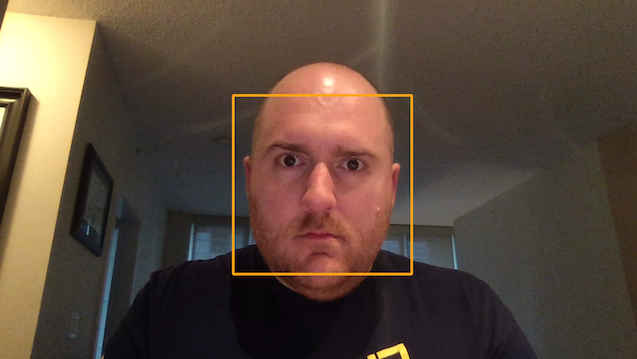
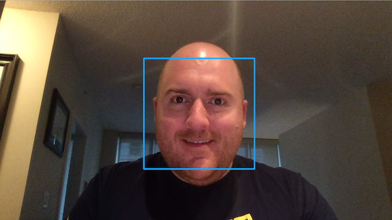

# deeplens-facial-emotion
An AWS Deeplens Challenge Submission Trying to Measure a Viewers Reaction to Funny Media

## The Goal

The main goal of the project is to replace the "focus group" the movie studios would have to perform when a new comedy movie comes out. Instead of having a small group of people from a mall in Iowa determining if something is subjectively funny, our goal is to use the Deeplens to look a a viewers reaction and simply measure their smiles and laughs to more quantitatively determine their reaction to a movie. Also, by automating the process of gauging a viewers reaction while watching media, we can allow many more subjects to partcipate since we aren't limited to human facilitators to run the experiment. People could just volunteer to have a camera put on them while watching a movie.

To achieve this, we need a project that will identify users in view as they view a movie screener, and a model which will detect their reaction. Our deeplens project is about detecting faces in a frame and using a Convolutional Neural Network model to determine if they are smiling in a particular frame. 

Since there is no pre-made model of facial expressions we need to train out own model using AWS Services.

## Training Set Creation

Before we can train a model we need a dataset. Using the [Labelled Faces in the Wild](http://vis-www.cs.umass.edu/lfw/) dataset, we have 13,000 faces in varios states of expression.

However, we need these labelled to have a "smile" or not and since we didn't really have time to manually check these we decided to make use of [Amazon Rekognition](https://aws.amazon.com/rekognition/) to label the images for us.

While this means our model's accuracy will have an upper bound of Rekognition's accuracy, we have great faith in the Amazon AI team's work.

Using Rekognition, we get a payload of each of the 13,000 images which look like.

```
{
  "Smile": {
    "Value": false,
    "Confidence": 93.7759780883789
  },
  "Emotions": [
    {
      "Type": "HAPPY",
      "Confidence": 91.7003402709961
    },
    {
      "Type": "CALM",
      "Confidence": 12.208562850952148
    },
    {
      "Type": "SAD",
      "Confidence": 9.688287734985352
    }
  ]
}
```

While eventually we'd like to make use of other emotions for things like comedies and what-not, for now we're just focused on smiling and laughing for comedies. However, the Deeplens networks were not about to handle more than one output up until less than a week before due date :-P.

In order to focus the learning of the model on faces, we make us of [OpenCV's Haar Cascades](https://docs.opencv.org/3.3.0/d7/d8b/tutorial_py_face_detection.html) to crop the images to just the faces, as seen below:


We wrap up the 13,000 cropped images (split into training and validation sets) into [rec files](https://mxnet.incubator.apache.org/tutorials/basic/image_io.html) for easier training with Gluon. With all the labels we've parsed. Though, we'll just train on smiles for now.

```
python im2rec.py   ~/deeplens-facial-emotion/listfile-train.lst ~/deeplens-facial-emotion/cnn-face/
python im2rec.py   ~/deeplens-facial-emotion/listfile-val.lst ~/deeplens-facial-emotion/cnn-face/
```

All this work can be seen in the `dataset-creation.ipynb` notebook.

## The Custom Model (Smile Net)

With our 2 Rec files for training in validation, we can then train a modified [AlexNet](https://en.wikipedia.org/wiki/AlexNet) to make a Convolutional Neural Network (with the last 2 dense layers lightened to bring down model size) for training.

After 30 epochs and about an 80% accuracy rate, we can then output the model to S3 for use in our Deeplens project.

All this work can be seen in the `face-detection-model-creation` notebook.

The outputted models can be seen in the `models` folder with the `smile-net` prefix

## The Lambda Function

Our lambda function to run inference is based off the "face-detection" example. However, our function uses the model optimizer on load and uses the OpenCV's Haar Cascade to detect faces first instead of the model.

For each face detected using the Haar cascade, we use our optimized `smile-net` model to determine if 

Instead, the model we use is our created `smile-net` model which we run on each individual face that is detected. For each face that is "smiling", we draw a blueish frame around the face, and for each neutral face we draw a redish frame around the discovered face. 

The `lambda_package` folder contains the modified `greengrassHelloWorld.py` file, and the `haarcascade_frontalface_alt.xml` file. The remaining files from the detect-faces were excluded.





## Demo Video

[]()

## Further Work

* Obviously a better initial dataset would help training.
* More effort into the emotion model would be useful as it's 80% accuracy probably isn't enough for what we'd want out system to do
* Right now we're just uploading one "face" to the IoT event. For this to work better, we'd want to individually assign faces when we get them and track them through the field of view.


